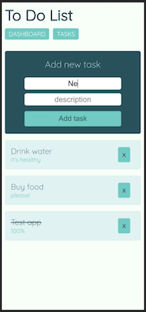

# To Do List - Fullstack app

## Test
- Tested with Jest
- Coverage 100%
## Built using:
### Backend
- Node.js
- Express
- MongoDB
- Mongoose

### Frontend
- React.js
- Redux
- CSS & SASS

## Required:

- Node.js

## How to run the project:

- `npm install` to install dependencies
- `npm run dev`to run in development enviroment
- `npm run build && npm start`to run in production environment

## License

- MIT
